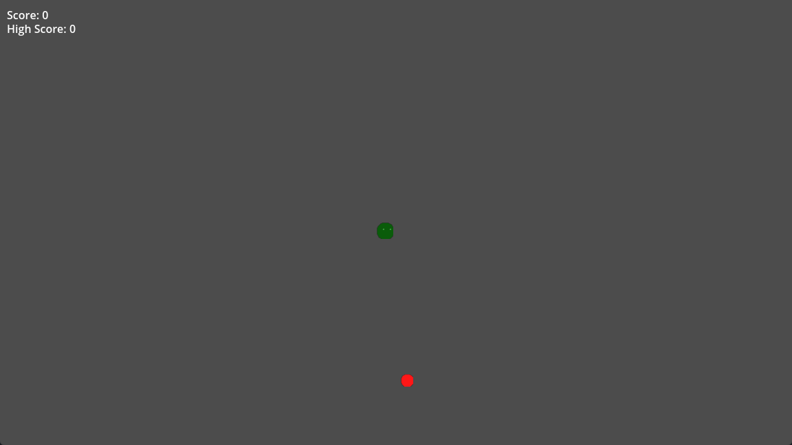

# snake.godot
貪吃蛇 Godot 版



## 安裝 MCP server
```bash
npm install -g @coding-solo/godot-mcp
```

## opencode MCP 設定
C:\Users\【你的使用者名稱】\.opencode\opencode.json
```json
"godot": {
    "type": "local",
    "command": ["npx", "-y", "@coding-solo/godot-mcp"],
    "env": {
        "GODOT_PATH": "D:\\Godot\\4.2.2\\Godot_v4.2.2-stable_win64.exe"
    },
    "enabled": true
}
```

## 參考
https://github.com/Coding-Solo/godot-mcp

